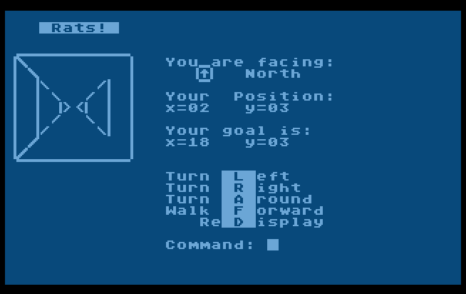

# Rats
A maze game for Atari 8-bit computers, which I wrote in Atari BASIC from 1987-1989

RATS! is a perspective maze game. Apparently I completed this version in my last semester of high school. I'm not disgusted by it, though it is slow and not fun. It was available to play on Weird City BBS.

The map is the same every time, stored in RATDATA which can be edited, somehow?

Press # to see the map.
